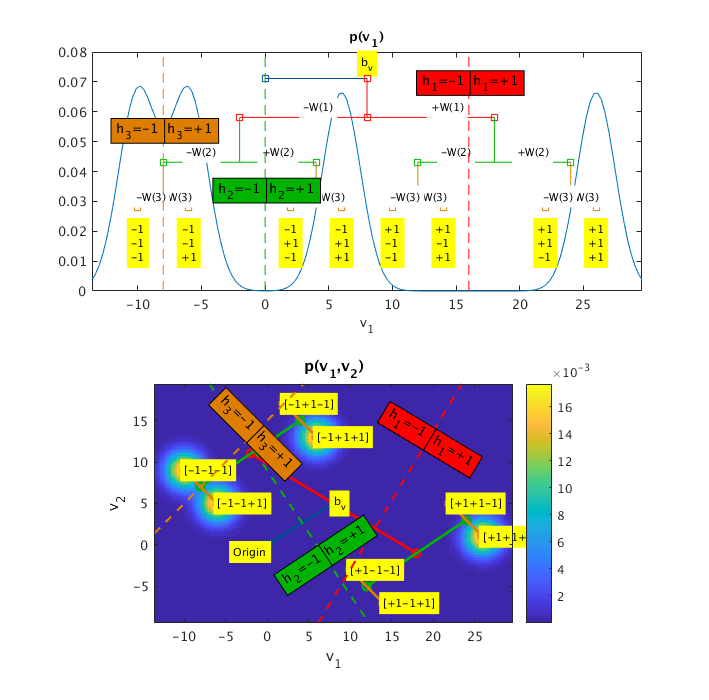

# Gaussian-Bipolar Restricted Boltzmann Machines
The code for the paper ***"On the Importance of Hidden Bias and Hidden Entropy in Representational Efficiency of the Gaussian-Bipolar Restricted Boltzmann Machines"*** by A. Isabekov and E. Erzin, published in 
[Neural Networks, Vol. 105, September 2018, Pages 405-418](https://www.sciencedirect.com/science/article/pii/S0893608018301849).

Training GBPRBM model using Contrastive Divergence alogrithm for three-dimensional data (number of visible units is equal to 3).

Passing one to the function enables loading pretrained weights from LBG-like clustering alogirthm.
Pretrained weights are stored in "GeometryLBG.mat" file.

    >> Synthetic_Data_3D_Train_GBPRBM(1)

Invoking the function without any arguments enables random initialization of the weights:

    >> Synthetic_Data_3D_Train_GBPRBM

To obtain "GeometryLBG.mat" file, run

    >> GBPRBM_LBG_Pretraining

Executing **PaperFig_VPDF_1V_2V_3V.m** will create

Executing **GBPRBM_Plot_HEntropy_vs_HBias_1H_Analysis.m** will create

Executing **GBPRBM_Plot_HEntropy_vs_HBias_2H_Analysis.m** will create

Executing **GBPRBM_Plot_HEntropy_vs_HBias_3H_Analysis.m** will create

